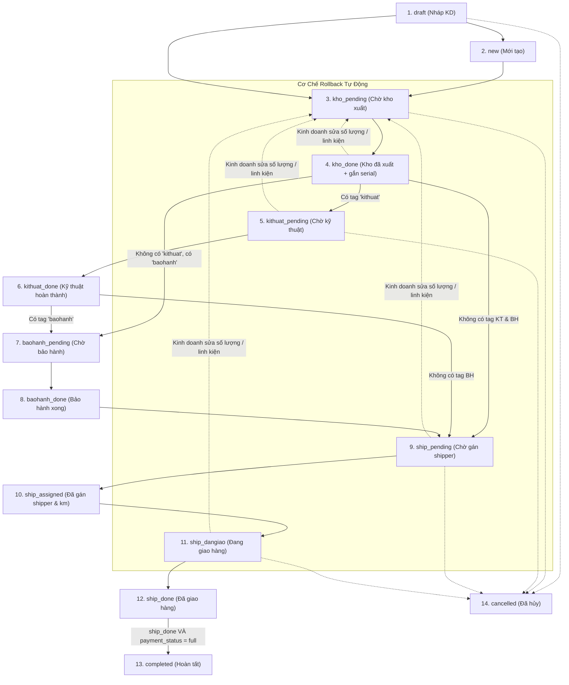
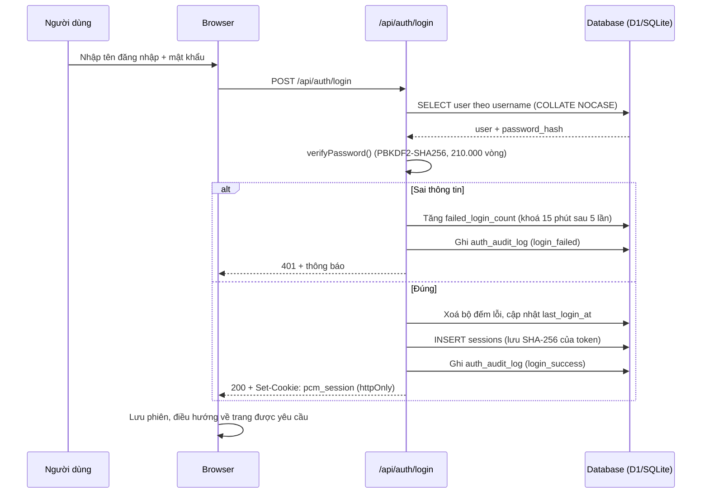

# PCM Vận Hành

Hệ thống quản lý vận hành cho cửa hàng linh kiện máy tính & build PC: đơn hàng, kho, kỹ thuật, bảo hành, giao hàng và tài khoản nhân viên — trên một màn hình duy nhất.

| | |
|---|---|
| Tên dự án | `pcm-van-hanh` |
| Tên Cloudflare Worker / Pages | `pcm-van-hanh` |
| Tên D1 database | `pcm-van-hanh-db` |
| Cổng mặc định | `http://localhost:3000` |

Dự án Web App phát triển bằng **Next.js (App Router, TypeScript)**, hỗ trợ cơ sở dữ liệu **Cloudflare D1 (SQLite)** và triển khai lên **Cloudflare Pages / Workers**.

---

## 1. Trục Dữ Liệu Trung Tâm & State Machine (14 Trạng Thái)

Đơn hàng di chuyển tuần tự qua nhiều bộ phận chuyên trách, mỗi bộ phận có hàng đợi riêng, quyền thao tác riêng, và ghi chú riêng.



### Quy tắc chuyển trạng thái & nghiệp vụ
1. **Sau `kho_done`**:
   - Nếu đơn có tag `kithuat` → sang `kithuat_pending`.
   - Nếu đơn không có tag `kithuat` nhưng có tag `baohanh` → sang `baohanh_pending`.
   - Nếu có cả 2: **Kỹ thuật xử lý trước, bảo hành xử lý sau**.
   - Nếu không có tag nào → chuyển thẳng sang `ship_pending`.
2. **Cơ chế Rollback**:
   - Khi Kinh doanh sửa đơn (đổi số lượng / thêm-bớt linh kiện) sau khi đơn đã ở `kho_done` trở đi, hệ thống **tự động set lại status về `kho_pending`** để kho chuẩn bị lại hàng.
   - Serial cũ đã gán được **lưu lại dưới dạng JSON snapshot trong `order_status_history`** (không xóa) để phục vụ kiểm đếm thu hồi và đối chiếu.
3. **Sửa / Hủy đơn**:
   - Kinh doanh có thể sửa hoặc hủy đơn ở **bất kỳ thời điểm nào trước `completed`**.
4. **Trạng thái đơn và thanh toán độc lập**:
   - `order.status` và `payment_status` ("unpaid" | "partial" | "full") là độc lập nhau. Đơn hàng có thể đang `ship_dangiao` mà chưa thanh toán đủ tiền.
   - Khi Shipper giao xong (`ship_done`) **VÀ** thanh toán đạt `full` → hệ thống tự động hoàn tất sang `completed`.

---

## 2. Vai Trò (8 Roles) & Quyền Hạn

| Vai trò | Mã role | Mô tả & Chức năng chuyên biệt |
|---|---|---|
| **Admin** | `admin` | Toàn quyền kiểm soát, xem tất cả các hàng đợi, **quản lý tài khoản người dùng**, cấu hình hệ thống |
| **Kinh doanh** | `kinh_doanh` | Tạo đơn (chọn linh kiện, tồn kho realtime, cho đặt hàng khi hết, chọn tag), chọn phương thức thanh toán, sửa/hủy đơn trước `completed` |
| **Kho** | `kho` | Hàng đợi `kho_pending`. Màn hình xuất kho với máy quét mã vạch (Keyboard Wedge mode), gán serial từng linh kiện, in phiếu xuất kho |
| **Kỹ thuật** | `ky_thuat` | Hàng đợi `kithuat_pending`. Lắp ráp, đi dây, cài Win & test máy. Tích hoàn thành + ghi chú → chuyển `kithuat_done` |
| **Quản lý kỹ thuật** | `quan_ly_ky_thuat` | **Chỉ giám sát/điều phối tiến độ, KHÔNG DUYỆT, KHÔNG CHẶN LUỒNG**, xem danh sách như kỹ thuật viên |
| **Bảo hành** | `bao_hanh` | Hàng đợi `baohanh_pending`. Kiểm tra linh kiện lỗi, xem đơn gốc liên kết (`related_order_id`), tích hoàn thành + ghi chú → chuyển `baohanh_done` |
| **Quản lý ship** | `quan_ly_ship` | Hàng đợi `ship_pending`. Chọn shipper, tính khoảng cách (Google Maps API + nhập tay override) → chuyển `ship_assigned` |
| **Shipper** | `shipper` | Hàng đợi cá nhân. Bắt đầu giao (`ship_dangiao`) → Giao xong (`ship_done`). Thu tiền COD (QR / Tiền mặt / CK) → kích hoạt `completed` khi đủ 100% |

---

## 3. Hệ Thống Đăng Nhập & Quản Lý Tài Khoản

### 3.1. Luồng đăng nhập



### 3.2. Cơ chế bảo mật

| Cơ chế | Chi tiết |
|---|---|
| Mật khẩu | **PBKDF2-SHA256**, 210.000 vòng, salt ngẫu nhiên 16 byte (`lib/crypto.ts`). Không thêm dependency, chạy được trên Node.js và Cloudflare Workers |
| Phiên đăng nhập | Token ngẫu nhiên 32 byte, cookie `pcm_session` cờ `httpOnly` + `sameSite=lax` + `secure` (production), hạn 7 ngày |
| Lưu trữ phiên | Database **chỉ lưu SHA-256 của token** → lộ database cũng không dùng lại được cookie |
| Chống dò mật khẩu | Sai 5 lần → khoá 15 phút. Sai tên đăng nhập cũng phải băm mật khẩu giả để không lộ ra sự khác biệt thời gian phản hồi |
| Chính sách mật khẩu | **Không ràng buộc độ phức tạp.** Chỉ chặn mật khẩu rỗng và quá 128 ký tự — nhân viên dùng mật khẩu ngắn vẫn đăng nhập được |
| Đổi mật khẩu | Tự do, không bắt buộc. Mỗi tài khoản tự đổi trong menu tài khoản trên header |
| Thu hồi phiên | Đổi mật khẩu, đổi vai trò, đổi tên đăng nhập, vô hiệu hoạt → xoá **toàn bộ** phiên của tài khoản đó |
| Chống tự khoá | Admin không thể tự vô hiệu hoạt / tự hạ quyền, hệ thống luôn giữ ≥ 1 tài khoản Admin hoạt động |
| Nhật ký | Mọi thao tác đăng nhập và quản trị tài khoản được ghi vào `auth_audit_log` |
| Bảo vệ route | `middleware.ts` chặn mọi trang/API khi thiếu cookie → redirect `/login` hoặc trả 401. Xác thực thật diễn ra server-side qua `requireUser()` |

> Middleware chạy ở edge runtime nên chỉ kiểm tra **sự hiện diện** của cookie. Việc tra cứu `sessions`, kiểm tra hạn và `is_active` được thực hiện ở server (`lib/auth.ts`) cho mọi API route.

### 3.3. Tài khoản mẫu (seed)

Đăng nhập tại `http://localhost:3000/login`:

| Tên đăng nhập | Vai trò | Mật khẩu |
|---|---|---|
| `admin` | Admin Toàn Quyền | `Pcshop@123` |
| `sale` | Kinh Doanh | `Pcshop@123` |
| `kho` | Kho | `Pcshop@123` |
| `kythuat` | Kỹ Thuật | `Pcshop@123` |
| `qlkythuat` | Quản Lý Kỹ Thuật | `Pcshop@123` |
| `baohanh` | Bảo Hành | `Pcshop@123` |
| `qlship` | Quản Lý Ship | `Pcshop@123` |
| `shipper1` / `shipper2` | Shipper | `Pcshop@123` |

Tài khoản seed đăng nhập được ngay, không bắt buộc đổi mật khẩu.

### 3.4. Mục "Nhân viên & Vai trò" (gộp cả quản lý tài khoản)

Một mục duy nhất trên thanh điều hướng, dùng chung cho **danh sách nhân viên** và **tài khoản đăng nhập**:

- **Mọi người đã đăng nhập** thấy: thống kê nhân sự, danh sách nhân viên kèm vai trò, tìm kiếm và lọc theo vai trò. Đây là dữ liệu thật từ bảng `users`, không phải dữ liệu mẫu.
- **Chỉ `admin`** thấy thêm: nút *Tạo tài khoản*, cột thao tác (sửa hồ sơ, đổi vai trò, đặt lại mật khẩu, khoá / mở khoá / vô hiệu hoạt) và tab *Nhật ký đăng nhập & quản trị*.

Các thao tác quản trị:

1. **Tạo tài khoản** — họ tên, tên đăng nhập (chữ thường không dấu), email, SĐT, vai trò. Bỏ trống mật khẩu → hệ thống sinh mật khẩu ngẫu nhiên, **hiển thị đúng 1 lần**.
2. **Sửa hồ sơ / đổi vai trò** — đổi tên đăng nhập hoặc hạ vai trò sẽ buộc đăng nhập lại.
3. **Khoá & mở khoá** — vô hiệu hoạt (soft delete) hoặc gỡ khoá sau khi bị khoá do sai mật khẩu.
4. **Đặt lại mật khẩu** — sinh mật khẩu ngẫu nhiên, huỷ mọi phiên đang hoạt động của tài khoản đó.
5. **Nhật ký** — xem toàn bộ đăng nhập / thao tác quản trị gần đây.

Người dùng tự đổi mật khẩu bất cứ lúc nào qua menu tài khoản trên header hoặc tab "Bảo mật" trong Cài đặt.

### 3.5. API

| Method | Endpoint | Quyền | Mô tả |
|---|---|---|---|
| `POST` | `/api/auth/login` | công khai | Đăng nhập, trả cookie phiên |
| `GET` | `/api/auth/me` | đăng nhập | Thông tin người dùng hiện tại |
| `POST` | `/api/auth/me` | đăng nhập | Đăng xuất (xoá phiên + cookie) |
| `POST` | `/api/auth/change-password` | đăng nhập | Tự đổi mật khẩu |
| `GET` | `/api/admin/users` | `account:manage` | Danh sách tài khoản (kể cả đã khoá) |
| `POST` | `/api/admin/users` | `account:manage` | Tạo tài khoản mới |
| `PATCH` | `/api/admin/users/[id]` | `account:manage` | Sửa hồ sơ, đổi vai trò, khoá/mở khoá |
| `DELETE` | `/api/admin/users/[id]` | `account:manage` | Vô hiệu hoạt tài khoản |
| `POST` | `/api/admin/users/[id]/reset-password` | `account:manage` | Đặt lại mật khẩu |
| `GET` | `/api/admin/audit-logs` | `audit:read` | Nhật ký đăng nhập & quản trị |

### 3.6. Đặt lại mật khẩu bằng CLI

Dùng khi không còn tài khoản Admin nào đăng nhập được:

```bash
# Sinh mật khẩu ngẫu nhiên
npm run user:password -- admin

# Đặt mật khẩu cụ thể (không giới hạn độ phức tạp)
npm run user:password -- admin "123"
```

Lệnh này cũng mở khoá tài khoản, kích hoạt lại tài khoản bị vô hiệu hoạt và huỷ mọi phiên đang hoạt động.

---

## 4. Cấu Trúc Database (Cloudflare D1 / SQLite)

- **users**: `id, name, phone, email, role, is_active, created_at` + `username, password_hash, last_login_at, failed_login_count, locked_until, updated_at`
- **sessions**: `id (sha256 token), user_id, user_agent, ip, created_at, last_seen_at, expires_at`
- **auth_audit_log**: `id, actor_user_id, actor_name, action, target_user_id, target_name, detail, ip, created_at`
- **products**: `id, sku, name, unit_price, stock_qty, category, created_at`
- **orders**: `id, invoice_no, invoice_date, customer_name, customer_phone, customer_address, customer_email, tags, note, sales_user_id, status, payment_status, related_order_id, total_amount, paid_amount, created_at, updated_at`
- **order_items**: `id, order_id, product_id, quantity, unit_price, warranty_months, serial_number, created_at`
- **order_status_history**: `id, order_id, status, changed_by_user_id, note, snapshot_serials, created_at`
- **payments**: `id, order_id, method ("qr" | "cash" | "transfer"), amount, collected_by_user_id, paid_at`
- **shipments**: `id, order_id, shipper_id, assigned_by_user_id, address, distance_km, km_source ("gg_map" | "manual"), created_at`
- **schema_migrations**: `name, applied_at` (dùng cho bộ chạy migration tự động ở local)

---

## 5. Tính Năng Nổi Bật

1. **Đăng Nhập & Quản Lý Tài Khoản Thật**:
   - Đăng nhập bằng tên đăng nhập + mật khẩu (PBKDF2, phiên server-side, cookie httpOnly).
   - Admin tạo / sửa / khoá tài khoản, đổi vai trò, đặt lại mật khẩu và theo dõi nhật ký.
2. **Quét Mã Vạch Chuẩn Keyboard Wedge**:
   - Hỗ trợ máy quét mã vạch cầm tay (USB/Bluetooth HID keyboard).
   - Tự động nhận diện mã sản phẩm, điền Serial Number và chuyển dòng tiếp theo.
   - Cung cấp các nút bấm mô phỏng quét mã vạch giả lập để kiểm thử ngay trên trình duyệt mà không cần máy quét vật lý.
3. **In Phiếu Xuất Kho & Bàn Giao Thiết Bị (Print View)**:
   - Layout A4 / Máy in nhiệt chuẩn công nghiệp với thông tin linh kiện, serials, điều khoản bảo hành và 5 chữ ký đối chiếu.
4. **Tích Hợp Google Maps Distance Matrix API**:
   - Tự động ước lượng và tính km giao hàng, hỗ trợ ô nhập tay override khi cần điều chỉnh thực tế.
5. **Cơ Chế Rollback & Snapshot Serials An Toàn**:
   - Khi kinh doanh sửa đơn sau xuất kho, toàn bộ serials cũ được đóng gói vào snapshot JSON trong lịch sử trước khi rollback về kho.

---

## 6. Hướng Dẫn Cài Đặt & Chạy Thử

### Chạy Local (Next.js + SQLite cục bộ)

Yêu cầu Node.js **22.5 trở lên**. SQLite local dùng module có sẵn trong Node.js, không cần cài Python hoặc biên dịch native module.

```bash
# 1. Cài đặt thư viện
npm install

# 2. Reset database & nạp dữ liệu mẫu (chạy đủ các migration)
npm run db:reset

# 3. Kiểm thử tự động
npm run test:flow      # luồng nghiệp vụ & state machine
npm run test:auth      # đăng nhập, phiên, khoá tài khoản, phân quyền

# 4. Khởi chạy server phát triển
npm run dev
```

Mở trình duyệt tại `http://localhost:3000` → hệ thống chuyển sang `/login`. Đăng nhập bằng `admin` / `Pcshop@123`.

> `npm run db:reset` cần tắt dev server trước (SQLite không cho xoá file khi đang mở). Nếu chỉ muốn nạp thêm migration mới thì bộ chạy migration trong `lib/db.ts` tự áp dụng file chưa chạy và ghi vào bảng `schema_migrations`.

### Triển khai lên Cloudflare D1 & Pages
1. Cấu hình D1 trong `wrangler.jsonc`:
```jsonc
{
  "name": "pcm-van-hanh",
  "d1_databases": [
    {
      "binding": "DB",
      "database_name": "pcm-van-hanh-db",
      "database_id": "your-d1-database-id"
    }
  ]
}
```
2. Thực thi migrations trên Cloudflare D1 (bộ chạy migration tự động chỉ dùng cho SQLite local):
```bash
npx wrangler d1 execute DB --file=migrations/0001_initial_schema.sql
npx wrangler d1 execute DB --file=migrations/0002_seed_data.sql
npx wrangler d1 execute DB --file=migrations/0003_auth_accounts.sql
npx wrangler d1 execute DB --file=migrations/0004_simplify_password.sql
npx wrangler d1 execute DB --file=migrations/0005_order_address_item_warranty.sql
```
> `0003` dùng `ALTER TABLE ADD COLUMN` nên chỉ chạy **một lần** trên mỗi database. Nếu cần đổi mật khẩu admin trên D1 sau khi deploy, chạy lệnh SQL tương đương `npm run user:password` với hash được sinh từ `lib/crypto.ts`.

3. Deploy Pages:
```bash
npx wrangler pages deploy .next
```
